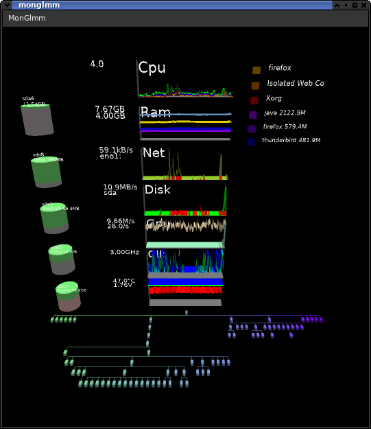

# monglmm

A fancy system-monitor for Linux using OpenGL.

configure:
     allow --with-gles using GL ES 3 e.g. useful on Raspi's (requires same use on GenericGlm) 
     allow --with-libg15 using G15 lcd display see libg15 
     allow --with-lmsensors using lmsensors for display 
     allow  --with-raspi build with raspi core voltage (which is not moving) info (function is (c) broadcom) beware: breaks --with-gles 

