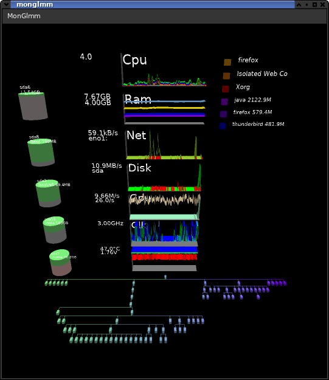

# monglmm

A fancy system-monitor for Linux using OpenGL.

- graphs for cpu,memory,network,disk,gpu,clock and sensors
- display of top three processes using cpu and memory
- display of pocess tree indicating high cpu usage, details are visible on selection, on double click classic gui views
- overview of disk alloation
- display of network connections with protocol and domain-names
- viewing of log entries (as configured with genericImg)
- support for g15-keyboard lcd and keys

Build with meson, requires genericImg, genericGlm (see there for some basic build infos).
The gles config is taken over from genericGlm (if GL-ES was used the Gpu values will be not be available). 

meson options :
<pre>
     allow -Dlibg15=true using G15 lcd display see libg15
     allow -Dlmsensors=false to disable lmsensors display values
    (obsolet  -Draspi=true build with raspi core voltage (which is not moving) info (function is (c) broadcom) beware: breaks -Dgles=true)
</pre>

## Log view

- this was build with a desktop-system in mind, if your system has GBytes of logs it will probably not display all infos.
    If you still feel the limit of displayed lines dosn't fit your needs
    change it in mongl.conf section LogProperties key logViewRowLimit
    if you don't mind the used resources
- with systemd-logging there is a overhead to assign bootId's to times 
   this may result in some waiting period for the first invocation
   (depending on the used storage, this has become faster in '25),
   but over time that should improve.
